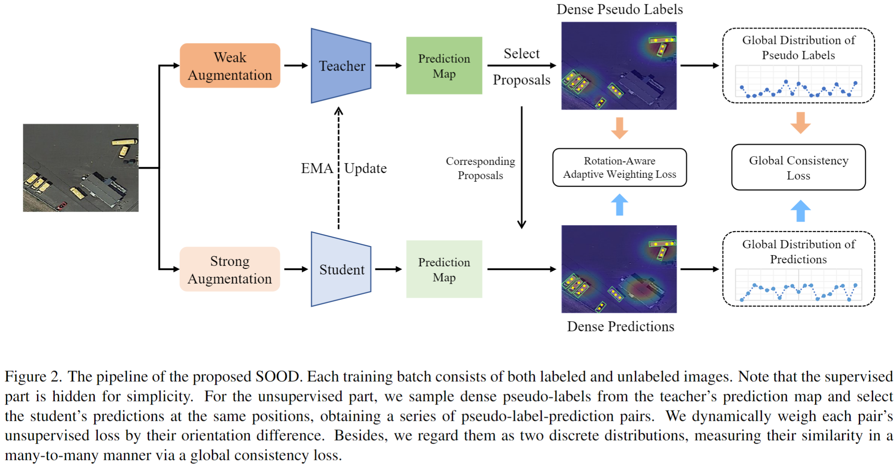

# SOOD
An official implementation of "SOOD: Towards Semi-Supervised Oriented Object Detection" (Accepted by CVPR 2023).

# Introduction
Semi-Supervised Object Detection~(SSOD), aiming to explore unlabeled data for boosting object detectors, has become an active task in recent years. However, existing SSOD approaches mainly focus on horizontal objects, leaving multi-oriented objects that are common in aerial images unexplored. This paper proposes a novel Semi-supervised Oriented Object Detection model, termed SOOD, built upon the mainstream pseudo-labeling framework. Towards oriented objects in aerial scenes, we design two loss functions to provide better supervision. Focusing on the orientations of objects, the first loss regularizes the consistency between each pseudo-label-prediction pair (includes a prediction and its corresponding pseudo label) with adaptive weights based on their orientation gap. Focusing on the layout of an image, the second loss regularizes the similarity and explicitly builds the many-to-many relation between the sets of pseudo-labels and predictions. Such a global consistency constraint can further boost semi-supervised learning. Our experiments show that when trained with the two proposed losses, SOOD surpasses the state-of-the-art SSOD methods under various settings on the DOTA-v1.5 benchmark.



# Training
Code will be released soon.


## Acknowledgement
Many thanks to the brilliant works ([DenseTeacher](https://github.com/Megvii-BaseDetection/DenseTeacher), [SoftTeacher](https://github.com/microsoft/SoftTeacher) and [DMCount](https://github.com/cvlab-stonybrook/DM-Count))!


## Citation

If you find this codebase helpful, please consider to cite:

```
@article{Hua2023SOOD,
  title={SOOD: Towards Semi-Supervised Oriented Object Detection},
  author={Wei Hua, Dingkang Liang, Jingyu Li, Xiaolong Liu, Zhikang Zou, Xiaoqing Ye, Xiang Bai},
  journal={CVPR},
  year={2023}
} 
```